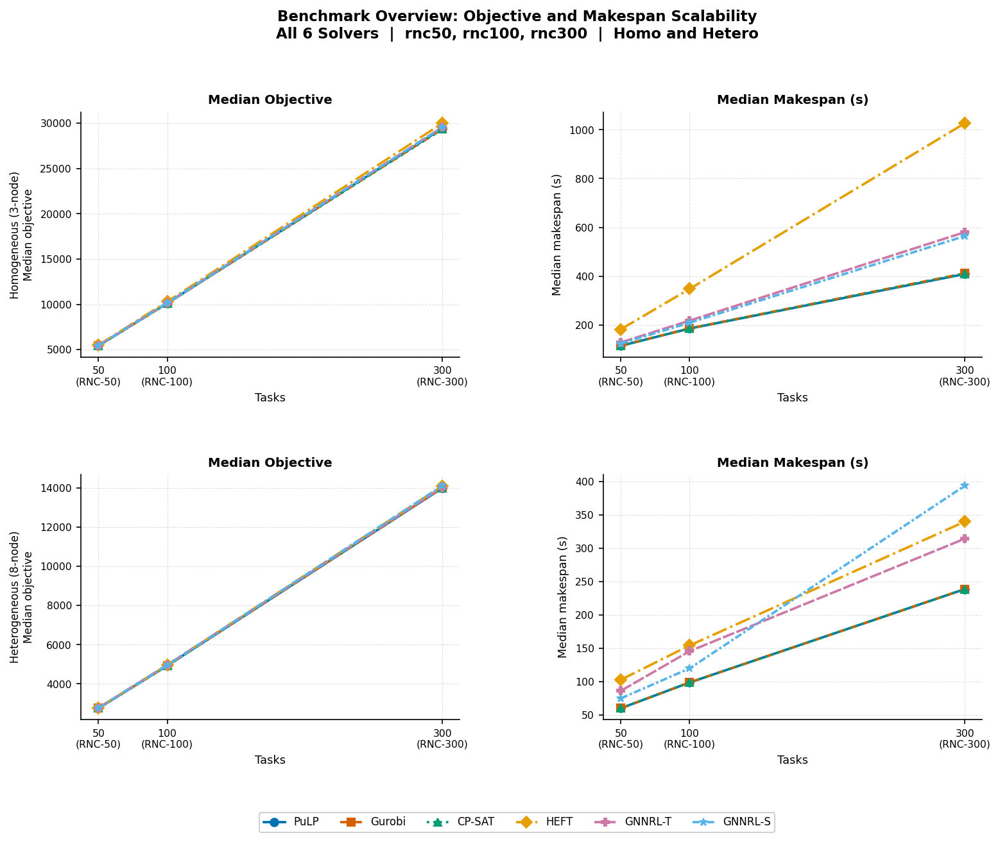
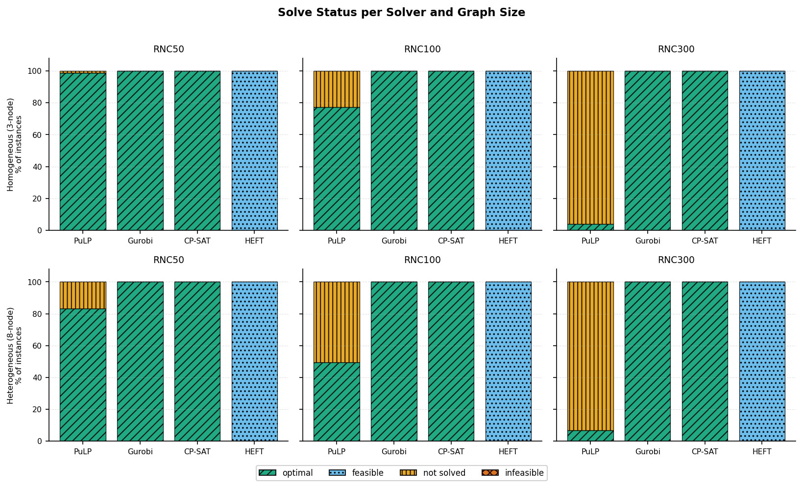

# STG Workflow Scheduling Benchmark Suite for Heterogeneous HPC Systems

This repository provides solver implementations, analysis scripts, and result figures for
research on **workflow mapping and scheduling in heterogeneous High Performance Computing (HPC) systems**.

The project builds on the **Standard Task Graph (STG) benchmark suite** (Kasahara et al., Waseda University)
by converting STG task graphs into structured JSON workflow representations and benchmarking
six scheduling solvers across multiple graph sizes and system configurations.

---

## Zenodo Datasets

| Dataset | DOI | Contents |
|---|---|---|
| STG JSON Input Graphs | [10.5281/zenodo.18927122](https://doi.org/10.5281/zenodo.18927122) | 540 STG workflow instances (rnc50/100/300, homo/hetero) in JSON format |
| Multi-Solver Benchmark Results | [10.5281/zenodo.20419279](https://doi.org/10.5281/zenodo.20419279) | 6,480 JSON result files from 6 solvers x 3 graph sizes x 2 system modes x 180 instances |

---

## Repository Structure

```
grapheonrl-benchmark/
+-- stg_to_json_dataset/          Input graph conversion tools and system configurations
+-- stg_to_json_benchmarks/       Solver implementations (MILP, CP-SAT, HEFT)
+-- benchmark_results/            Figure generation script and all analysis figures
|   +-- generate_figures.py
|   +-- figures/                  21 PDF + 21 PNG figures + summary_stats.csv
+-- README.md
```

---

## Solvers

| Solver | Class | Implementation |
|---|---|---|
| MILP (PuLP) | Exact | `stg_to_json_benchmarks/milp_solver.py` |
| MILP (Gurobi) | Exact | `stg_to_json_benchmarks/milp_solver_gurobi.py` |
| CP-SAT | Exact | `stg_to_json_benchmarks/cp_sat_solver.py` |
| HEFT | Heuristic | `stg_to_json_benchmarks/heft_solver.py` |
| GNNRL (self) | Learned | GNN-RL model (separate training repo) |
| GNNRL (teacher) | Learned | GNN-RL model with teacher guidance (separate training repo) |

---

## Benchmark Scale (Phase I)

All runs are **Small Scale Benchmark Tests in Edge Device (Phase I)**, executed on an
Intel Core i5-1145G7 edge device (4 cores / 8 threads, 15 W TDP, 16 GB RAM, Ubuntu 22.04.5 LTS).

| Graph size | Tasks | System modes | Instances per cell | Total per solver |
|---|---|---|---|---|
| rnc50 | 50 | homo (3-node), hetero (8-node) | 180 | 360 |
| rnc100 | 100 | homo (3-node), hetero (8-node) | 180 | 360 |
| rnc300 | 300 | homo (3-node), hetero (8-node) | 180 | 360 |

Total: 6 solvers x 6 cells x 180 instances = **6,480 result files**

Phase II cluster-based validation on real HPC infrastructure will be published as a
separate companion dataset.

---

## Reproducing Results

**Run a solver** (example: HEFT on one workflow):

```bash
cd stg_to_json_benchmarks
python heft_solver.py --input workflow.json --system hetero_8node.json
```

**Regenerate all figures** from the raw Zenodo data:

```bash
cd benchmark_results
# Place main_results/ folder (extracted from benchmark_solver_results_main.zip) here
python generate_figures.py
```

See `benchmark_results/README.md` for full reproduction instructions.

---

## Preview Figures

### Benchmark Overview: Objective and Makespan Scalability



### Solve Status by Solver and Graph Size



---

## Citation

If you use this repository or the associated datasets, please cite:

**Input workflow graphs (STG JSON dataset):**

```bibtex
@dataset{Sharma2026STGDataset,
  author    = {Sharma, Aasish Kumar and Kunkel, Julian Martin},
  title     = {Standard Task Graph ({STG}) Dataset With {JSON} Conversions
               for Workflow Scheduling in Heterogeneous High Performance
               Computing ({HPC}) Systems},
  year      = {2026},
  publisher = {Zenodo},
  doi       = {10.5281/zenodo.18927122},
  url       = {https://doi.org/10.5281/zenodo.18927122}
}
```

**Benchmark solver results:**

```bibtex
@dataset{Sharma2026BenchmarkResults,
  author    = {Sharma, Aasish Kumar and Kunkel, Julian Martin},
  title     = {Standard Task Graph ({STG}) Multi-Solver Benchmark Results
               for Workflow Scheduling in Heterogeneous High Performance
               Computing ({HPC}) Systems},
  year      = {2026},
  publisher = {Zenodo},
  doi       = {10.5281/zenodo.20419279},
  url       = {https://doi.org/10.5281/zenodo.20419279}
}
```

---

## Dataset Provenance

Input workflow graphs are derived from the **Standard Task Graph (STG) benchmark suite**:

Hiroshi Kasahara, Waseda University
https://www.kasahara.cs.waseda.ac.jp/schedule/stgarc_e.html

---

## Authors

| Author | ORCID |
|---|---|
| Aasish Kumar Sharma | [0000-0002-7514-2340](https://orcid.org/0000-0002-7514-2340) |
| Julian Martin Kunkel | [0000-0002-6915-1179](https://orcid.org/0000-0002-6915-1179) |

University of Gottingen / GWDG, Germany
